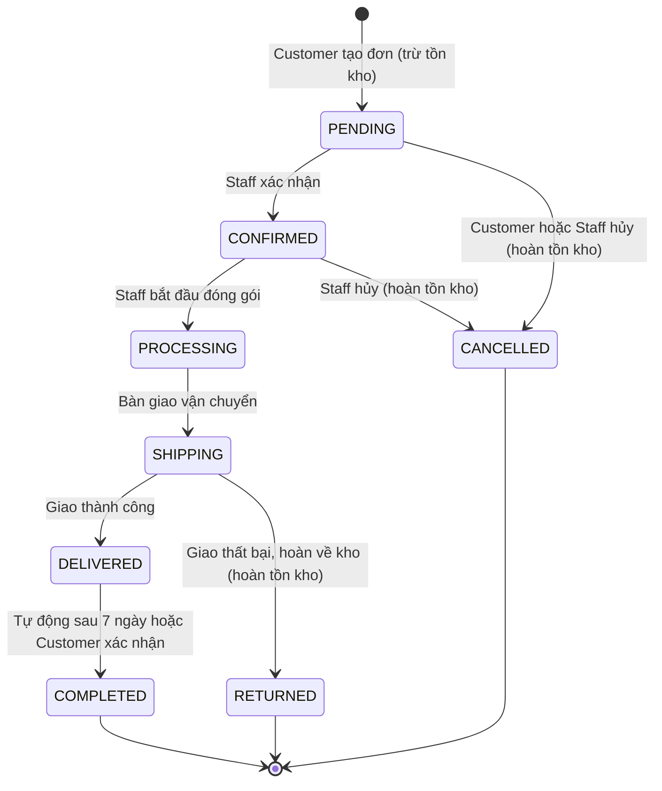
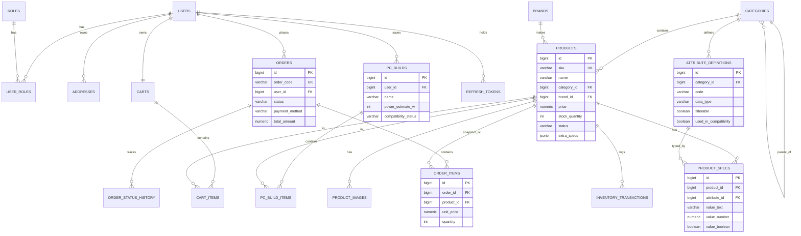
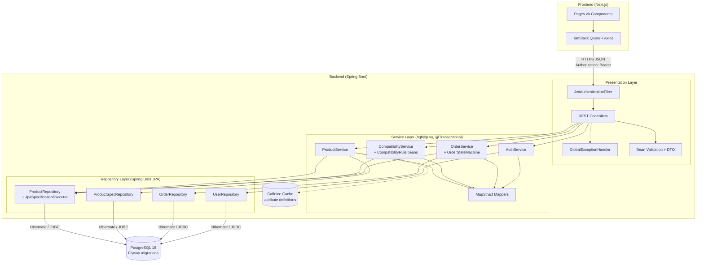
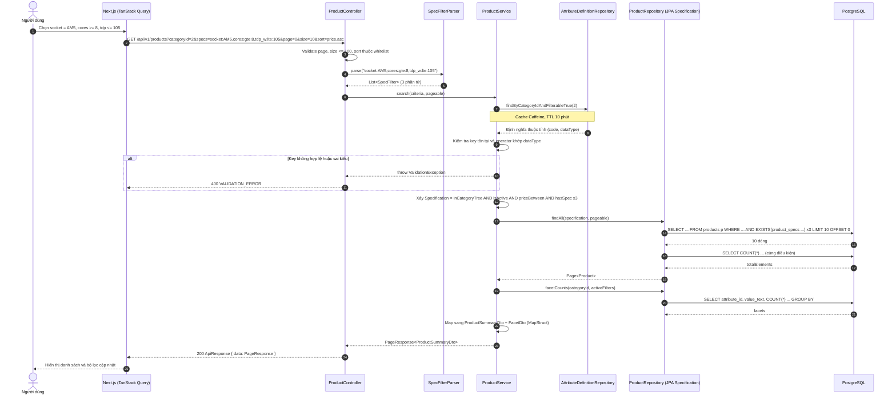

# Tài liệu Kỹ thuật ĐATN: Hệ thống TMĐT Linh kiện PC & Build PC

Oct 9, 2026 · @hector

## Phần 1: Bảo vệ đề tài và phạm vi

Đề tài giải quyết hai bài toán mà e-commerce thông thường không có: lưu trữ thông số kỹ thuật động cho hàng chục loại linh kiện và kiểm tra tương thích tự động khi khách tự build PC.

### 1.1 Tên đề tài và mục tiêu

|  | Nội dung |
| --- | --- |
| Tên tiếng Việt | Xây dựng hệ thống thương mại điện tử bán linh kiện máy tính và hỗ trợ build PC |
| Tên tiếng Anh | Building an E-commerce System for PC Components with a PC Build Assistant |
| Mô hình tham khảo | kccshop.vn (catalog linh kiện, bộ lọc thông số, công cụ Build PC) |
| Loại sản phẩm | Web application, kiến trúc REST API tách biệt Backend (Spring Boot) và Frontend (Next.js) |

**Mục tiêu tổng quát (General Objective):** xây dựng một hệ thống TMĐT hoàn chỉnh cho ngành hàng linh kiện PC, cho phép khách hàng tìm kiếm linh kiện theo thông số kỹ thuật, tự lắp ráp cấu hình được kiểm tra tương thích, và đặt hàng trực tuyến.

**Mục tiêu cụ thể (Specific Objectives):**

1. Thiết kế mô hình dữ liệu hỗ trợ thuộc tính động (Dynamic Attributes) cho nhiều loại linh kiện mà không cần thay đổi schema khi thêm danh mục mới.
2. Cài đặt bộ lọc đa thông số (Multi-spec Filtering) với phân trang và sắp xếp chuẩn REST, sử dụng JPA Specifications.
3. Cài đặt công cụ Build PC với bộ luật kiểm tra tương thích (Compatibility Rules Engine) và tính tổng công suất tiêu thụ (Power Budget).
4. Cài đặt quy trình đặt hàng với máy trạng thái đơn hàng (Order State Machine) và quản lý tồn kho cơ bản.
5. Bảo mật hệ thống bằng JWT Authentication và phân quyền theo vai trò (RBAC) cho 3 vai trò: GUEST/CUSTOMER, STAFF, ADMIN.
6. Tài liệu hóa API bằng OpenAPI 3 (Swagger UI) và kiểm thử bằng JUnit 5, Mockito, Testcontainers.

### 1.2 Phân tích nghiệp vụ đặc thù (Domain Analysis)

Bán linh kiện PC khác với bán hàng tổng hợp ở chỗ giá trị của sản phẩm nằm ở thông số kỹ thuật, và các sản phẩm phụ thuộc lẫn nhau.

| Khía cạnh | E-commerce tổng hợp (Shopee, Tiki) | E-commerce linh kiện PC (kccshop.vn) | Hệ quả thiết kế |
| --- | --- | --- | --- |
| Mô hình dữ liệu sản phẩm | Vài thuộc tính chung: tên, giá, màu, kích cỡ | Mỗi danh mục có bộ thông số riêng: CPU (socket, core, TDP), Mainboard (socket, chipset, form factor, RAM type), RAM (DDR4/DDR5, bus), PSU (wattage, chuẩn 80 Plus), Case (form factor hỗ trợ, chiều dài GPU tối đa) | Cần Dynamic Attributes theo danh mục (Category Attribute Schema) |
| Tìm kiếm và lọc | Lọc theo giá, thương hiệu, đánh giá | Lọc đồng thời nhiều thông số: socket = AM5 AND TDP <= 105W AND số nhân >= 8 | Cần Spec Filtering với toán tử EQ/IN/RANGE, index trên bảng thông số |
| Quan hệ giữa sản phẩm | Độc lập, mua gì cũng được | Phụ thuộc chặt: CPU phải khớp socket Mainboard, RAM phải khớp chuẩn DDR, PSU phải đủ công suất, Case phải chứa được Mainboard và GPU | Cần Compatibility Rules Engine chạy trên thông số đã chuẩn hóa |
| Hành vi mua hàng | Mua lẻ từng món | Mua theo bộ (Build) 7 đến 9 linh kiện, giá trị đơn cao, khách cần tư vấn | Cần PC Builder lưu được cấu hình, chuyển cả bộ vào giỏ hàng |
| Giá và tồn kho | Giá ổn định | Giá biến động theo tuần (GPU, RAM), tồn kho ít đơn vị mỗi SKU | Cần snapshot giá tại thời điểm đặt hàng, trừ tồn khi xác nhận đơn |

**Bài toán cốt lõi 1: thuộc tính động.** Một hệ thống có 10 danh mục, mỗi danh mục 8 đến 15 thông số, tổng cộng hơn 100 cột thông số khác nhau. Thiết kế cột cứng trong bảng products là không khả thi. Phần 3 phân tích ba giải pháp (EAV, JSONB, Separate Tables) và chọn giải pháp phù hợp với Spring Data JPA.

**Bài toán cốt lõi 2: kiểm tra tương thích.** Một bộ PC hợp lệ phải thỏa đồng thời ít nhất 6 nhóm luật: Socket (CPU và Mainboard), RAM Type (RAM và Mainboard), Form Factor (Mainboard và Case), Power Budget (tổng TDP và công suất PSU), Kích thước vật lý (GPU và Case), Kết nối lưu trữ (M.2 và SATA). Mỗi luật là một hàm thuần (pure function) nhận thông số và trả về kết quả PASS, WARNING hoặc FAIL. Phần 2 đặc tả chi tiết.

### 1.3 Phạm vi tính năng cốt lõi (Core Features Scope)

Phạm vi được giới hạn ở những tính năng chứng minh được hai bài toán cốt lõi và quy trình bán hàng đầu cuối. Mức ưu tiên theo MoSCoW.

| Tác nhân (Actor) | Nhóm tính năng | Mô tả | Ưu tiên |
| --- | --- | --- | --- |
| Guest, Customer | Xem danh mục và sản phẩm | Duyệt cây danh mục, xem chi tiết sản phẩm với bảng thông số, hình ảnh, giá, tồn kho | Must |
| Guest, Customer | Lọc đa thông số (Spec Filtering) | Lọc theo danh mục, khoảng giá, thương hiệu và nhiều thông số kỹ thuật cùng lúc; phân trang, sắp xếp | Must |
| Guest, Customer | Công cụ Build PC | Chọn linh kiện theo từng slot (CPU, Mainboard, RAM, GPU, Storage, PSU, Case, Cooler), kiểm tra tương thích thời gian thực, tính tổng công suất và tổng giá, lưu cấu hình (Customer), thêm cả bộ vào giỏ | Must |
| Guest, Customer | Giỏ hàng (Cart) | Thêm, sửa số lượng, xóa; Guest lưu giỏ phía client, Customer lưu phía server | Must |
| Customer | Đặt hàng và bảng giá | Checkout từ giỏ, nhập địa chỉ giao hàng, chọn phương thức thanh toán COD hoặc chuyển khoản, nhận mã đơn | Must |
| Customer | Tra cứu đơn hàng | Xem lịch sử đơn, chi tiết đơn, trạng thái hiện tại, hủy đơn khi còn ở trạng thái PENDING | Must |
| Customer | Tài khoản | Đăng ký, đăng nhập, làm mới token, đổi mật khẩu, quản lý địa chỉ | Must |
| Admin, Staff | Quản lý danh mục và linh kiện | CRUD danh mục, sản phẩm, hình ảnh, giá; ẩn hoặc hiện sản phẩm | Must |
| Admin | Quản lý thuộc tính động | Định nghĩa bộ thuộc tính cho từng danh mục: tên, kiểu dữ liệu, đơn vị, có lọc được hay không, dùng cho luật tương thích hay không | Must |
| Admin, Staff | Quản lý đơn hàng | Xem danh sách đơn, lọc theo trạng thái, chuyển trạng thái theo máy trạng thái, ghi chú nội bộ | Must |
| Admin, Staff | Quản lý tồn kho cơ bản | Xem và điều chỉnh số lượng tồn, cảnh báo dưới ngưỡng, lịch sử nhập xuất đơn giản | Should |
| Admin | Quản lý người dùng và vai trò | Danh sách người dùng, gán vai trò STAFF, khóa tài khoản | Should |
| Admin | Dashboard thống kê | Doanh thu theo ngày, đơn theo trạng thái, top sản phẩm | Could |

**Ngoài phạm vi (Out of Scope):** tích hợp cổng thanh toán thật (VNPay, MoMo), tích hợp đơn vị vận chuyển, đánh giá và bình luận sản phẩm, chương trình khuyến mãi phức tạp, đa ngôn ngữ, ứng dụng di động. Các mục này được ghi nhận là hướng phát triển trong chương kết luận.

## Phần 2: Đặc tả yêu cầu phần mềm (SRS)

Hệ thống có 20 yêu cầu chức năng chia theo 5 nhóm nghiệp vụ và 9 yêu cầu phi chức năng. Ba nghiệp vụ phức tạp nhất (lọc đa thông số, kiểm tra tương thích, máy trạng thái đơn hàng) được đặc tả thuật toán riêng ở mục 2.2 đến 2.4.

### 2.1 Yêu cầu chức năng (Functional Requirements)

| Mã | Tên yêu cầu | Tác nhân | Input | Output | Ưu tiên |
| --- | --- | --- | --- | --- | --- |
| FR-01 | Đăng ký tài khoản | Guest | email, password, fullName, phone | Tài khoản mới với vai trò CUSTOMER; 201 Created | Must |
| FR-02 | Đăng nhập | Guest | email, password | accessToken (JWT, 15 phút), refreshToken (7 ngày), thông tin user | Must |
| FR-03 | Làm mới token | Customer, Staff, Admin | refreshToken | accessToken mới; 401 nếu token hết hạn hoặc bị thu hồi | Must |
| FR-04 | Xem cây danh mục | Guest | không | Danh sách danh mục dạng cây (parent, children), kèm số sản phẩm | Must |
| FR-05 | Xem chi tiết sản phẩm | Guest | productId hoặc slug | Thông tin sản phẩm, bảng thông số theo nhóm, hình ảnh, giá, tồn kho | Must |
| FR-06 | Lọc sản phẩm đa thông số | Guest | categoryId, specs, minPrice, maxPrice, brandIds, keyword, page, size, sort | Trang sản phẩm thỏa toàn bộ điều kiện AND; metadata phân trang; danh sách giá trị lọc khả dụng (facets) | Must |
| FR-07 | Tìm kiếm từ khóa | Guest | keyword | Sản phẩm có tên hoặc SKU chứa từ khóa, không phân biệt dấu | Should |
| FR-08 | Quản lý giỏ hàng | Customer | productId, quantity | Giỏ hàng hiện tại với tổng tiền; 409 nếu vượt tồn kho | Must |
| FR-09 | Chọn linh kiện vào slot Build PC | Guest, Customer | slot (CPU, MAINBOARD, RAM, GPU, STORAGE, PSU, CASE, COOLER), productId | Trạng thái build hiện tại; danh sách sản phẩm gợi ý tương thích cho slot kế tiếp | Must |
| FR-10 | Kiểm tra tương thích bộ PC | Guest, Customer | Danh sách cặp slot và productId | status COMPATIBLE, WARNING hoặc INCOMPATIBLE; danh sách issues theo luật; tổng công suất ước tính; tổng giá | Must |
| FR-11 | Lưu và tải cấu hình Build | Customer | tên build, danh sách linh kiện | buildId; danh sách build đã lưu của user | Should |
| FR-12 | Chuyển Build vào giỏ hàng | Customer | buildId | Giỏ hàng gồm toàn bộ linh kiện của build | Must |
| FR-13 | Tạo đơn hàng | Customer | Danh sách items, địa chỉ giao hàng, paymentMethod (COD, BANK\_TRANSFER), note | Đơn hàng trạng thái PENDING, mã đơn, snapshot giá; 409 nếu hết hàng | Must |
| FR-14 | Tra cứu đơn hàng | Customer | orderId hoặc orderCode | Chi tiết đơn, lịch sử chuyển trạng thái | Must |
| FR-15 | Hủy đơn hàng | Customer | orderId, lý do | Đơn chuyển sang CANCELLED, tồn kho được hoàn; 409 nếu đơn không còn ở PENDING | Must |
| FR-16 | CRUD danh mục | Admin | name, slug, parentId, attributeDefinitions | Danh mục được tạo hoặc cập nhật | Must |
| FR-17 | CRUD sản phẩm và thông số | Admin, Staff | name, sku, categoryId, brandId, price, stock, specs (map key và value), images | Sản phẩm với thông số đã validate theo định nghĩa thuộc tính của danh mục | Must |
| FR-18 | Quản lý thuộc tính động | Admin | categoryId, code, name, dataType (TEXT, NUMBER, BOOLEAN, ENUM), unit, filterable, usedInCompatibility, enumOptions | Định nghĩa thuộc tính cho danh mục; 409 nếu xóa thuộc tính đang được sản phẩm sử dụng | Must |
| FR-19 | Chuyển trạng thái đơn hàng | Admin, Staff | orderId, targetStatus, note | Đơn ở trạng thái mới, ghi lịch sử; 409 nếu chuyển trạng thái không hợp lệ | Must |
| FR-20 | Điều chỉnh tồn kho | Admin, Staff | productId, delta, reason | Tồn kho mới, bản ghi lịch sử; cảnh báo khi dưới ngưỡng | Should |

### 2.2 Thuật toán lọc linh kiện nâng cao (FR-06)

Bộ lọc nhận tham số specs dưới dạng chuỗi có cú pháp xác định, dịch sang JPA Specification với một mệnh đề EXISTS cho mỗi điều kiện, rồi kết hợp bằng AND.

**Cú pháp Query Parameter:**

```text
specs=<filter>(,<filter>)*
<filter> = <attributeCode>:<value>                 → so sánh bằng (EQ)
         | <attributeCode>:in:<v1>|<v2>|<v3>      → thuộc tập (IN)
         | <attributeCode>:gte:<number>            → lớn hơn hoặc bằng
         | <attributeCode>:lte:<number>            → nhỏ hơn hoặc bằng

Ví dụ: GET /api/v1/products?categoryId=1&specs=socket:AM5,cores:gte:8,tdp:lte:105&minPrice=3000000&page=0&size=10&sort=price,asc
```

**Các bước xử lý:**

1. Parse chuỗi specs thành danh sách SpecFilter(key, operator, values). Lỗi cú pháp trả 400 với mã VALIDATION\_ERROR.
2. Tải định nghĩa thuộc tính của danh mục (cache trong Caffeine 10 phút). Loại bỏ hoặc trả 400 với key không tồn tại, không filterable, hoặc operator không khớp kiểu dữ liệu (gte trên TEXT).
3. Xây dựng Specification gốc: category thuộc cây danh mục đã chọn, status = ACTIVE, giá trong khoảng, brand thuộc tập.
4. Với mỗi SpecFilter, thêm một Specification dạng EXISTS subquery trên product\_specs. Kết hợp tất cả bằng Specification.allOf.
5. Thực thi findAll(spec, pageable). Spring Data chạy hai câu SQL: SELECT có LIMIT OFFSET và SELECT COUNT.
6. Tính facets: với mỗi thuộc tính filterable của danh mục, GROUP BY giá trị trên tập kết quả (bỏ qua chính điều kiện đang lọc của thuộc tính đó).
7. Ánh xạ sang ProductSummaryDto và bọc trong PageResponse.

**Cài đặt lõi bằng JPA Criteria API:**

```java
public static Specification<Product> hasSpec(SpecFilter f) {
    return (root, query, cb) -> {
        Subquery<Long> sq = query.subquery(Long.class);
        Root<ProductSpec> ps = sq.from(ProductSpec.class);
        Join<ProductSpec, AttributeDefinition> attr = ps.join("attribute");

        Predicate valueMatch = switch (f.operator()) {
            case EQ  -> cb.equal(ps.get("valueText"), f.firstValue());
            case IN  -> ps.get("valueText").in(f.values());
            case GTE -> cb.ge(ps.get("valueNumber"), f.asNumber());
            case LTE -> cb.le(ps.get("valueNumber"), f.asNumber());
        };

        sq.select(ps.get("product").get("id"))
          .where(cb.equal(ps.get("product"), root),
                 cb.equal(attr.get("code"), f.key()),
                 valueMatch);
        return cb.exists(sq);
    };
}

// Kết hợp trong Service
Specification<Product> spec = Specification.allOf(
    ProductSpecs.inCategoryTree(categoryIds),
    ProductSpecs.isActive(),
    ProductSpecs.priceBetween(minPrice, maxPrice),
    ProductSpecs.brandIn(brandIds),
    Specification.allOf(filters.stream().map(ProductSpecs::hasSpec).toList())
);
Page<Product> page = productRepository.findAll(spec, pageable);
```

Độ phức tạp: mỗi EXISTS dùng index tổng hợp (attribute\_id, value\_text) hoặc (attribute\_id, value\_number) trên product\_specs, nên chi phí xấp xỉ O(k × log n) với k là số điều kiện và n là số dòng thông số. Với 10.000 sản phẩm và 5 điều kiện, mục tiêu p95 dưới 200 ms là khả thi (xem NFR-01).

### 2.3 Thuật toán kiểm tra tương thích Build PC (FR-10)

Bộ luật chạy trên thông số đã chuẩn hóa của từng linh kiện. Mỗi luật là một hàm thuần nhận BuildContext và trả về danh sách CompatibilityIssue. Kết quả tổng hợp là mức nghiêm trọng cao nhất.

**Input:** danh sách cặp (slot, productId). Slot RAM và STORAGE cho phép nhiều sản phẩm. **Output:** status, issues, powerEstimateWatt, recommendedPsuWatt, totalPrice.

| Mã luật | Linh kiện liên quan | Thuộc tính so sánh | Điều kiện PASS | Mức khi vi phạm |
| --- | --- | --- | --- | --- |
| R01 SOCKET\_MATCH | CPU, Mainboard | cpu.socket, mb.socket | Bằng nhau (AM5 = AM5) | FAIL |
| R02 RAM\_TYPE | RAM, Mainboard | ram.memory\_type, mb.memory\_type | Bằng nhau (DDR5 = DDR5) | FAIL |
| R03 RAM\_SLOTS | RAM, Mainboard | tổng ram.modules, mb.ram\_slots | Tổng số thanh RAM ≤ số khe | FAIL |
| R04 RAM\_MAX\_CAPACITY | RAM, Mainboard | tổng ram.capacity\_gb, mb.max\_memory\_gb | Tổng dung lượng ≤ dung lượng tối đa | FAIL |
| R05 RAM\_SPEED | RAM, Mainboard | ram.speed\_mhz, mb.max\_memory\_speed\_mhz | Bus RAM ≤ bus tối đa mainboard | WARNING (RAM chạy ở bus thấp hơn) |
| R06 MB\_FORM\_FACTOR | Mainboard, Case | mb.form\_factor, case.supported\_mb\_form\_factors | form\_factor thuộc danh sách hỗ trợ | FAIL |
| R07 GPU\_LENGTH | GPU, Case | gpu.length\_mm, case.max\_gpu\_length\_mm | Chiều dài GPU ≤ giới hạn | FAIL |
| R08 GPU\_PCIE\_SLOT | GPU, Mainboard | mb.pcie\_x16\_slots | Có ít nhất 1 khe PCIe x16 | FAIL |
| R09 COOLER\_SOCKET | Cooler, CPU | cooler.supported\_sockets, cpu.socket | Socket CPU thuộc danh sách hỗ trợ | FAIL |
| R10 COOLER\_HEIGHT | Cooler, Case | cooler.height\_mm, case.max\_cooler\_height\_mm | Chiều cao tản ≤ giới hạn (chỉ áp dụng tản khí) | FAIL |
| R11 COOLER\_TDP | Cooler, CPU | cooler.max\_tdp\_w, cpu.tdp\_w | TDP tản ≥ TDP CPU | WARNING |
| R12 PSU\_FORM\_FACTOR | PSU, Case | psu.form\_factor, case.supported\_psu\_form\_factors | ATX, SFX thuộc danh sách hỗ trợ | FAIL |
| R13 POWER\_BUDGET | PSU, tất cả | psu.wattage\_w, powerEstimate | psu.wattage ≥ powerEstimate × 1,3 | FAIL nếu psu.wattage < powerEstimate; WARNING nếu dưới ngưỡng dự phòng 30% |
| R14 M2\_SLOTS | Storage, Mainboard | số ổ M.2, mb.m2\_slots | Số ổ M.2 ≤ số khe M.2 | FAIL |
| R15 SATA\_PORTS | Storage, Mainboard | số ổ SATA, mb.sata\_ports | Số ổ SATA ≤ số cổng SATA | FAIL |
| R16 DISPLAY\_OUTPUT | CPU, GPU | cpu.has\_igpu, slot GPU | Có GPU rời hoặc CPU có iGPU | FAIL |
| R17 REQUIRED\_SLOTS | tất cả | slot CPU, MAINBOARD, RAM, STORAGE, PSU, CASE | Đủ 6 slot bắt buộc | WARNING (build chưa hoàn chỉnh) |

**Công thức ước tính công suất (Power Estimate):** hệ số là giá trị cấu hình trong application.yml, không hard-code.

```text
powerEstimate = cpu.tdp_w
              + gpu.tdp_w                       (0 nếu không có GPU)
              + MAINBOARD_BASE_W (50)
              + RAM_PER_MODULE_W (5) × tổng số thanh RAM
              + STORAGE_SSD_W (8) × số SSD + STORAGE_HDD_W (12) × số HDD
              + COOLER_W (10 tản khí, 25 tản nước AIO)
              + FANS_W (15)
recommendedPsuWatt = làm tròn lên bội số 50 của (powerEstimate × 1,3)
```

**Mã giả thuật toán tổng thể:**

```java
public CompatibilityResult check(BuildRequest req) {
    // 1. Tải toàn bộ sản phẩm và specs trong 1 query (JOIN FETCH), tránh N+1
    Map<Slot, List<Product>> bySlot = productRepository.findWithSpecsByIds(req.productIds())
        .stream().collect(groupingBy(p -> req.slotOf(p.getId())));

    // 2. Chuẩn hóa thành BuildContext: spec code -> giá trị đã ép kiểu
    BuildContext ctx = BuildContext.from(bySlot);

    // 3. Chạy tuần tự các luật, mỗi luật tự bỏ qua khi thiếu linh kiện liên quan
    List<CompatibilityIssue> issues = rules.stream()          // List<CompatibilityRule> inject qua Spring
        .flatMap(rule -> rule.evaluate(ctx).stream())
        .toList();

    // 4. Tổng hợp
    Severity worst = issues.stream().map(CompatibilityIssue::severity)
        .max(comparing(Severity::rank)).orElse(Severity.PASS);
    int power = powerCalculator.estimate(ctx);

    return new CompatibilityResult(worst.toStatus(), issues, power,
        powerCalculator.recommendPsu(power), ctx.totalPrice());
}
```

Mỗi luật là một Spring Bean implement CompatibilityRule, nên thêm luật mới chỉ cần thêm một class, không sửa service (Open/Closed Principle). Các luật được unit test độc lập với dữ liệu giả.

### 2.4 Quy trình đặt hàng và máy trạng thái đơn hàng (FR-13, FR-15, FR-19)

**Quy trình tạo đơn (Order Creation Flow), chạy trong một transaction:**

1. Validate request: items không rỗng, địa chỉ hợp lệ, paymentMethod thuộc tập cho phép.
2. Khóa dòng tồn kho của từng sản phẩm bằng SELECT FOR UPDATE (PESSIMISTIC\_WRITE) theo thứ tự productId tăng dần để tránh deadlock.
3. Kiểm tra stock ≥ quantity cho từng item. Thiếu một item bất kỳ trả 409 OUT\_OF\_STOCK kèm danh sách sản phẩm thiếu, rollback toàn bộ.
4. Trừ tồn kho (stock = stock − quantity), ghi inventory\_transactions với loại RESERVE.
5. Tạo Order ở trạng thái PENDING, sinh orderCode dạng ORD-yyyyMMdd-xxxxx. Tạo order\_items với snapshot productName, sku, unitPrice tại thời điểm đặt.
6. Ghi order\_status\_history (null → PENDING, actor = customer).
7. Commit. Sau commit, gửi sự kiện OrderCreatedEvent để gửi email xác nhận (bất đồng bộ, không ảnh hưởng transaction).

**Máy trạng thái đơn hàng (Order State Machine):**



| Từ trạng thái | Sang trạng thái | Tác nhân được phép | Điều kiện | Tác động phụ |
| --- | --- | --- | --- | --- |
| (mới) | PENDING | Customer | Đủ tồn kho | Trừ tồn kho (RESERVE) |
| PENDING | CONFIRMED | Staff, Admin | Đã liên hệ hoặc đã nhận chuyển khoản | Ghi history |
| PENDING | CANCELLED | Customer (đơn của mình), Staff, Admin | Bắt buộc có lý do | Hoàn tồn kho (RELEASE) |
| CONFIRMED | PROCESSING | Staff, Admin | không | Ghi history |
| CONFIRMED | CANCELLED | Staff, Admin | Bắt buộc có lý do | Hoàn tồn kho (RELEASE) |
| PROCESSING | SHIPPING | Staff, Admin | Có mã vận đơn (tùy chọn) | Ghi history |
| SHIPPING | DELIVERED | Staff, Admin | không | Ghi history, với COD đánh dấu paymentStatus = PAID |
| SHIPPING | RETURNED | Staff, Admin | Bắt buộc có lý do | Hoàn tồn kho (RELEASE) |
| DELIVERED | COMPLETED | Customer, Scheduler | Sau 7 ngày kể từ DELIVERED | Ghi history |

Mọi chuyển trạng thái đi qua một phương thức duy nhất OrderStateMachine.transition(order, target, actor). Phương thức này tra bảng chuyển hợp lệ (Map\<OrderStatus, Set\<OrderStatus>>), kiểm tra vai trò, và ném InvalidStateTransitionException (HTTP 409) nếu không hợp lệ. Cách này đơn giản hơn Spring State Machine và đủ cho 9 trạng thái.

### 2.5 Yêu cầu phi chức năng (Non-functional Requirements)

| Mã | Nhóm | Yêu cầu | Cách đo lường và kiểm chứng |
| --- | --- | --- | --- |
| NFR-01 | Hiệu năng | API đọc (danh sách, lọc, chi tiết) có thời gian phản hồi p95 < 200 ms với 10.000 sản phẩm, 100.000 dòng thông số, 50 người dùng đồng thời | Kịch bản k6 hoặc JMeter chạy trên môi trường Docker Compose; báo cáo p50, p95, p99 |
| NFR-02 | Hiệu năng | API kiểm tra tương thích p95 < 300 ms với build 10 linh kiện | k6; tải sản phẩm bằng một query JOIN FETCH, không N+1 |
| NFR-03 | Bảo mật | Xác thực bằng JWT (HS256, access token 15 phút, refresh token 7 ngày lưu DB để thu hồi). Mật khẩu băm BCrypt cost 10. Phân quyền RBAC bằng @PreAuthorize với 3 vai trò | Test tích hợp Spring Security; truy cập endpoint Admin bằng token CUSTOMER phải trả 403 |
| NFR-04 | Bảo mật | Chống injection bằng Prepared Statement (JPA), validate đầu vào bằng Bean Validation, CORS chỉ cho origin của Frontend, giới hạn 10 lần đăng nhập sai mỗi phút mỗi IP | Test đăng nhập sai liên tục trả 429; rà soát OWASP Top 10 |
| NFR-05 | Chuẩn REST | Mọi endpoint danh sách hỗ trợ page (từ 0), size (mặc định 20, tối đa 100), sort=field,asc hoặc desc với whitelist trường được sort | Test contract: size = 500 bị ép về 100; sort trường lạ trả 400 |
| NFR-06 | Chuẩn REST | Response bọc trong cấu trúc chuẩn (Phần 4), HTTP status đúng ngữ nghĩa, lỗi có mã máy đọc được; tài liệu OpenAPI 3 sinh tự động | Swagger UI tại /swagger-ui.html; test snapshot cấu trúc lỗi |
| NFR-07 | Toàn vẹn dữ liệu | Không bán vượt tồn kho khi 50 request đặt hàng đồng thời cùng một sản phẩm còn 1 đơn vị | Test đồng thời với ExecutorService và Testcontainers PostgreSQL: đúng 1 đơn thành công, 49 đơn nhận 409 |
| NFR-08 | Khả năng bảo trì | Kiến trúc phân tầng rõ ràng, DTO tách biệt Entity (MapStruct), độ phủ test tầng Service ≥ 70% | JaCoCo report trong CI |
| NFR-09 | Vận hành | Health check và metrics qua Spring Boot Actuator, log có correlationId cho mỗi request, cấu hình theo profile dev, test, prod | Endpoint /actuator/health; log mẫu trong báo cáo |

## Phần 3: Thiết kế cơ sở dữ liệu (Database Design)

Hệ thống dùng PostgreSQL 16 với mô hình EAV có định kiểu (Typed EAV) cho thuộc tính động cần lọc và kiểm tra tương thích, kết hợp một cột JSONB cho thông số chỉ hiển thị. Tổng cộng 17 bảng.

### 3.1 Giải pháp lưu trữ thuộc tính động

| Tiêu chí | EAV (Entity-Attribute-Value) | JSONB column | Separate Tables (mỗi danh mục một bảng) |
| --- | --- | --- | --- |
| Cách lưu | Bảng product\_specs: mỗi dòng là một cặp (product, attribute, value) | Cột products.specs kiểu JSONB chứa toàn bộ thông số | Bảng cpu\_specs, mainboard\_specs... mỗi bảng cột cứng |
| Thêm danh mục mới | Thêm dòng attribute\_definitions, không đổi schema | Không đổi schema | Thêm bảng, Entity, Repository, migration |
| Lọc đa điều kiện với JPA | JPA Criteria API và Specification hỗ trợ trực tiếp (EXISTS subquery), portable giữa PostgreSQL và MySQL | Cần hàm native (jsonb\_extract\_path\_text, @>), không portable; Hibernate 6 hỗ trợ hạn chế qua jsonb functions | Truy vấn SQL thường, nhanh nhất nhưng mỗi bảng một Specification riêng |
| Kiểm tra kiểu dữ liệu | Định kiểu qua attribute\_definitions.data\_type và cột value\_number, value\_text, value\_boolean | Không có schema, validate ở tầng ứng dụng | Mạnh nhất, kiểu ở mức cột DB |
| Index cho lọc | B-tree trên (attribute\_id, value\_number) và (attribute\_id, value\_text) | GIN index trên JSONB (chỉ PostgreSQL) | B-tree từng cột |
| Hiệu năng với 100.000 dòng specs | Tốt với index, mỗi điều kiện một EXISTS | Tốt với GIN, kém với so sánh khoảng số | Tốt nhất |
| Độ phức tạp code | Trung bình: 2 Entity, mapping key sang DTO | Thấp: Map\<String,Object> | Cao: số Entity tăng theo danh mục |
| Quản trị bởi Admin qua UI | Có, Admin tự định nghĩa thuộc tính (FR-18) | Có nhưng không ràng buộc | Không, cần lập trình viên |

**Quyết định: Typed EAV làm chủ đạo, JSONB bổ trợ.** Lý do:

1. FR-18 yêu cầu Admin tự định nghĩa thuộc tính theo danh mục, chỉ EAV đáp ứng mà không cần thay đổi code.
2. Bộ lọc và luật tương thích cần so sánh số (gte, lte), EAV với cột value\_number đánh index B-tree làm việc tốt trên cả PostgreSQL và MySQL.
3. JPA Specification xử lý EAV thuần JPQL, không cần native query, dễ unit test.
4. Thông số chỉ để hiển thị (mô tả bảo hành, cổng kết nối chi tiết) không cần lọc, lưu vào products.extra\_specs JSONB để giảm số dòng EAV.

Nhược điểm được chấp nhận: hiển thị chi tiết một sản phẩm cần JOIN product\_specs với attribute\_definitions (khoảng 15 dòng), giải quyết bằng @EntityGraph và cache.

### 3.2 Đặc tả bảng (Database Schema)

Quy ước: khóa chính BIGSERIAL (BIGINT tự tăng), mọi bảng có created\_at, updated\_at kiểu TIMESTAMPTZ do JPA Auditing điền. Tiền tệ VND lưu NUMERIC(15,0).

**Bảng users**

| Cột | Kiểu | Ràng buộc | Mô tả |
| --- | --- | --- | --- |
| id | BIGSERIAL | PK |  |
| email | VARCHAR(255) | UNIQUE, NOT NULL | Tài khoản đăng nhập |
| password\_hash | VARCHAR(100) | NOT NULL | BCrypt |
| full\_name | VARCHAR(150) | NOT NULL |  |
| phone | VARCHAR(20) |  |  |
| status | VARCHAR(20) | NOT NULL, CHECK IN (ACTIVE, LOCKED) |  |
| created\_at, updated\_at | TIMESTAMPTZ | NOT NULL |  |

**Bảng roles** và **user\_roles**

| Bảng | Cột | Kiểu | Ràng buộc |
| --- | --- | --- | --- |
| roles | id | BIGSERIAL | PK |
| roles | name | VARCHAR(30) | UNIQUE, NOT NULL (ROLE\_CUSTOMER, ROLE\_STAFF, ROLE\_ADMIN) |
| user\_roles | user\_id | BIGINT | PK (cùng role\_id), FK users(id) ON DELETE CASCADE |
| user\_roles | role\_id | BIGINT | PK, FK roles(id) |

**Bảng refresh\_tokens:** id PK, user\_id FK users, token VARCHAR(500) UNIQUE, expires\_at TIMESTAMPTZ, revoked BOOLEAN DEFAULT false.

**Bảng addresses:** id PK, user\_id FK users, receiver\_name, phone, line1, ward, district, province, is\_default BOOLEAN.

**Bảng categories**

| Cột | Kiểu | Ràng buộc | Mô tả |
| --- | --- | --- | --- |
| id | BIGSERIAL | PK |  |
| name | VARCHAR(100) | NOT NULL |  |
| slug | VARCHAR(120) | UNIQUE, NOT NULL | Dùng cho URL |
| parent\_id | BIGINT | FK categories(id), NULL | Cây danh mục (Adjacency List) |
| build\_slot | VARCHAR(20) | NULL, CHECK IN (CPU, MAINBOARD, RAM, GPU, STORAGE, PSU, CASE, COOLER) | Danh mục này ứng với slot nào trong Build PC |
| sort\_order | INT | DEFAULT 0 |  |

**Bảng brands:** id PK, name VARCHAR(100) UNIQUE, slug UNIQUE, logo\_url.

**Bảng attribute\_definitions** (định nghĩa thuộc tính động theo danh mục)

| Cột | Kiểu | Ràng buộc | Mô tả |
| --- | --- | --- | --- |
| id | BIGSERIAL | PK |  |
| category\_id | BIGINT | FK categories(id), NOT NULL |  |
| code | VARCHAR(50) | NOT NULL, UNIQUE (category\_id, code) | Khóa máy: socket, tdp\_w, memory\_type |
| name | VARCHAR(100) | NOT NULL | Tên hiển thị: Socket, TDP |
| data\_type | VARCHAR(10) | NOT NULL, CHECK IN (TEXT, NUMBER, BOOLEAN, ENUM) |  |
| unit | VARCHAR(20) | NULL | W, GB, MHz, mm |
| enum\_options | JSONB | NULL | Danh sách giá trị cho ENUM |
| filterable | BOOLEAN | NOT NULL DEFAULT false | Có xuất hiện trong bộ lọc |
| used\_in\_compatibility | BOOLEAN | NOT NULL DEFAULT false | Có dùng cho luật tương thích |
| display\_group | VARCHAR(50) | NULL | Nhóm hiển thị trên trang chi tiết |
| sort\_order | INT | DEFAULT 0 |  |

**Bảng products**

| Cột | Kiểu | Ràng buộc | Mô tả |
| --- | --- | --- | --- |
| id | BIGSERIAL | PK |  |
| sku | VARCHAR(50) | UNIQUE, NOT NULL |  |
| name | VARCHAR(255) | NOT NULL |  |
| slug | VARCHAR(280) | UNIQUE, NOT NULL |  |
| category\_id | BIGINT | FK categories(id), NOT NULL |  |
| brand\_id | BIGINT | FK brands(id), NOT NULL |  |
| price | NUMERIC(15,0) | NOT NULL, CHECK >= 0 | Giá bán hiện tại (VND) |
| original\_price | NUMERIC(15,0) | NULL | Giá gốc để hiển thị giảm giá |
| stock\_quantity | INT | NOT NULL DEFAULT 0, CHECK >= 0 | Tồn kho khả dụng |
| low\_stock\_threshold | INT | DEFAULT 5 |  |
| status | VARCHAR(20) | NOT NULL, CHECK IN (ACTIVE, HIDDEN, DISCONTINUED) |  |
| description | TEXT | NULL |  |
| extra\_specs | JSONB | NULL | Thông số chỉ hiển thị |
| thumbnail\_url | VARCHAR(500) | NULL |  |
| warranty\_months | INT | DEFAULT 36 |  |
| created\_at, updated\_at | TIMESTAMPTZ | NOT NULL |  |

**Bảng product\_images:** id PK, product\_id FK products ON DELETE CASCADE, url VARCHAR(500), sort\_order INT.

**Bảng product\_specs** (giá trị thuộc tính động)

| Cột | Kiểu | Ràng buộc | Mô tả |
| --- | --- | --- | --- |
| id | BIGSERIAL | PK |  |
| product\_id | BIGINT | FK products(id) ON DELETE CASCADE, NOT NULL |  |
| attribute\_id | BIGINT | FK attribute\_definitions(id), NOT NULL |  |
| value\_text | VARCHAR(255) | NULL | Cho TEXT và ENUM; luôn điền để hiển thị |
| value\_number | NUMERIC(12,2) | NULL | Cho NUMBER |
| value\_boolean | BOOLEAN | NULL | Cho BOOLEAN |
|  |  | UNIQUE (product\_id, attribute\_id) | Mỗi sản phẩm một giá trị cho mỗi thuộc tính |
|  |  | INDEX (attribute\_id, value\_number), INDEX (attribute\_id, value\_text) | Phục vụ lọc |

Thuộc tính dạng danh sách (Case hỗ trợ nhiều form factor) lưu value\_text dạng chuỗi phân cách dấu phẩy ATX,MATX,ITX; luật tương thích tách chuỗi khi so sánh.

**Bảng pc\_builds** và **pc\_build\_items**

| Bảng | Cột | Kiểu | Ràng buộc |
| --- | --- | --- | --- |
| pc\_builds | id | BIGSERIAL | PK |
| pc\_builds | user\_id | BIGINT | FK users(id), NOT NULL |
| pc\_builds | name | VARCHAR(150) | NOT NULL |
| pc\_builds | total\_price | NUMERIC(15,0) | NOT NULL, snapshot khi lưu |
| pc\_builds | power\_estimate\_w | INT | NULL |
| pc\_builds | compatibility\_status | VARCHAR(20) | CHECK IN (COMPATIBLE, WARNING, INCOMPATIBLE) |
| pc\_builds | created\_at, updated\_at | TIMESTAMPTZ | NOT NULL |
| pc\_build\_items | id | BIGSERIAL | PK |
| pc\_build\_items | build\_id | BIGINT | FK pc\_builds(id) ON DELETE CASCADE |
| pc\_build\_items | product\_id | BIGINT | FK products(id) |
| pc\_build\_items | slot | VARCHAR(20) | NOT NULL, CHECK IN (8 slot) |
| pc\_build\_items | quantity | INT | NOT NULL DEFAULT 1, CHECK > 0 |

**Bảng carts** và **cart\_items:** carts(id PK, user\_id FK users UNIQUE); cart\_items(id PK, cart\_id FK carts ON DELETE CASCADE, product\_id FK products, quantity INT CHECK > 0, UNIQUE (cart\_id, product\_id)).

**Bảng orders**

| Cột | Kiểu | Ràng buộc | Mô tả |
| --- | --- | --- | --- |
| id | BIGSERIAL | PK |  |
| order\_code | VARCHAR(30) | UNIQUE, NOT NULL | ORD-20261009-00042 |
| user\_id | BIGINT | FK users(id), NOT NULL |  |
| status | VARCHAR(20) | NOT NULL, CHECK IN (9 trạng thái) |  |
| payment\_method | VARCHAR(20) | NOT NULL, CHECK IN (COD, BANK\_TRANSFER) |  |
| payment\_status | VARCHAR(20) | NOT NULL, CHECK IN (UNPAID, PAID, REFUNDED) |  |
| subtotal | NUMERIC(15,0) | NOT NULL | Tổng tiền hàng |
| shipping\_fee | NUMERIC(15,0) | NOT NULL DEFAULT 0 |  |
| total\_amount | NUMERIC(15,0) | NOT NULL | subtotal + shipping\_fee |
| receiver\_name, receiver\_phone | VARCHAR | NOT NULL | Snapshot địa chỉ |
| shipping\_address | VARCHAR(500) | NOT NULL | Snapshot địa chỉ đầy đủ |
| customer\_note | VARCHAR(500) | NULL |  |
| created\_at, updated\_at | TIMESTAMPTZ | NOT NULL |  |

**Bảng order\_items**

| Cột | Kiểu | Ràng buộc | Mô tả |
| --- | --- | --- | --- |
| id | BIGSERIAL | PK |  |
| order\_id | BIGINT | FK orders(id) ON DELETE CASCADE, NOT NULL |  |
| product\_id | BIGINT | FK products(id), NOT NULL | Tham chiếu, không cascade |
| product\_name | VARCHAR(255) | NOT NULL | Snapshot tên tại thời điểm đặt |
| sku | VARCHAR(50) | NOT NULL | Snapshot |
| unit\_price | NUMERIC(15,0) | NOT NULL | Snapshot giá |
| quantity | INT | NOT NULL, CHECK > 0 |  |
| line\_total | NUMERIC(15,0) | NOT NULL | unit\_price × quantity |

**Bảng order\_status\_history:** id PK, order\_id FK orders, from\_status VARCHAR(20) NULL, to\_status VARCHAR(20) NOT NULL, changed\_by BIGINT FK users, note VARCHAR(500), changed\_at TIMESTAMPTZ.

**Bảng inventory\_transactions:** id PK, product\_id FK products, type VARCHAR(20) CHECK IN (IMPORT, RESERVE, RELEASE, ADJUST), quantity\_delta INT, reference\_type VARCHAR(20), reference\_id BIGINT, created\_by FK users, created\_at.

### 3.3 Quan hệ thực thể (Entity Relationships)

| Quan hệ | Loại | Cài đặt JPA |
| --- | --- | --- |
| users ↔ roles | N-N qua user\_roles | @ManyToMany với @JoinTable, fetch EAGER vì cần cho Security |
| users → addresses | 1-N | @OneToMany(mappedBy) |
| users → carts | 1-1 | @OneToOne, FK user\_id UNIQUE trên carts |
| users → pc\_builds, orders | 1-N | @ManyToOne phía con, LAZY |
| categories → categories | 1-N tự tham chiếu | @ManyToOne parent, @OneToMany children |
| categories → attribute\_definitions | 1-N | @OneToMany, orphanRemoval |
| categories, brands → products | 1-N | @ManyToOne LAZY |
| products → product\_specs | 1-N | @OneToMany cascade ALL, orphanRemoval; @EntityGraph khi xem chi tiết |
| attribute\_definitions → product\_specs | 1-N | @ManyToOne LAZY |
| products ↔ attribute\_definitions | N-N có thuộc tính (value) qua product\_specs | Entity trung gian ProductSpec, không dùng @ManyToMany |
| pc\_builds → pc\_build\_items → products | 1-N, N-1 | Entity trung gian có slot và quantity |
| orders → order\_items → products | 1-N, N-1 | Entity trung gian có snapshot giá |
| orders → order\_status\_history | 1-N | @OneToMany cascade PERSIST |



### 3.4 Index và tối ưu truy vấn

| Bảng | Index | Mục đích |
| --- | --- | --- |
| products | (category\_id, status, price) | Lọc theo danh mục, sắp xếp theo giá |
| products | GIN trên to\_tsvector('simple', name) hoặc pg\_trgm | Tìm kiếm từ khóa FR-07 (chỉ PostgreSQL) |
| product\_specs | (attribute\_id, value\_number), (attribute\_id, value\_text) | EXISTS subquery trong bộ lọc |
| product\_specs | UNIQUE (product\_id, attribute\_id) | Toàn vẹn và JOIN khi xem chi tiết |
| orders | (user\_id, created\_at DESC), (status, created\_at DESC) | Lịch sử đơn của khách, danh sách đơn cho Staff |
| categories | (parent\_id) | Dựng cây danh mục |

Schema được quản lý bằng Flyway migration (V1\_\_init.sql, V2\_\_seed\_attributes.sql), không dùng hibernate.ddl-auto = update trên môi trường ngoài dev.

## Phần 4: Thiết kế RESTful API

API có 42 endpoint chia thành 7 nhóm resource dưới tiền tố /api/v1, mọi response dùng chung một cấu trúc bọc, lỗi có mã máy đọc được và được xử lý tập trung bằng @RestControllerAdvice.

### 4.1 Quy chuẩn Response (Standard Response Wrapper)

**Thành công:**

```json
{
  "code": "SUCCESS",
  "message": "OK",
  "data": { },
  "timestamp": "2026-10-09T09:30:00Z"
}
```

**Thành công với phân trang:** data là PageResponse.

```json
{
  "code": "SUCCESS",
  "message": "OK",
  "data": {
    "content": [ ],
    "page": 0,
    "size": 10,
    "totalElements": 137,
    "totalPages": 14,
    "sort": "price,asc"
  },
  "timestamp": "2026-10-09T09:30:00Z"
}
```

**Lỗi:** errors chỉ xuất hiện với lỗi validation hoặc lỗi nghiệp vụ có chi tiết theo trường.

```json
{
  "code": "VALIDATION_ERROR",
  "message": "Dữ liệu không hợp lệ",
  "data": null,
  "errors": [
    { "field": "email", "message": "Email không đúng định dạng" },
    { "field": "password", "message": "Mật khẩu tối thiểu 8 ký tự" }
  ],
  "path": "/api/v1/auth/register",
  "timestamp": "2026-10-09T09:30:00Z"
}
```

```java
@Getter @Builder
@JsonInclude(JsonInclude.Include.NON_NULL)
public class ApiResponse<T> {
    private String code;
    private String message;
    private T data;
    private List<FieldError> errors;
    private String path;
    @Builder.Default private Instant timestamp = Instant.now();

    public static <T> ApiResponse<T> ok(T data) {
        return ApiResponse.<T>builder().code("SUCCESS").message("OK").data(data).build();
    }
}
```

**Bảng mã lỗi (Error Codes):**

| code | HTTP status | Khi nào |
| --- | --- | --- |
| VALIDATION\_ERROR | 400 | Bean Validation thất bại, cú pháp specs sai, sort field không hợp lệ |
| UNAUTHORIZED | 401 | Thiếu token, token hết hạn hoặc sai chữ ký |
| FORBIDDEN | 403 | Đã xác thực nhưng không đủ vai trò, hoặc truy cập đơn hàng của người khác |
| RESOURCE\_NOT\_FOUND | 404 | Không tìm thấy product, category, order, build |
| DUPLICATE\_RESOURCE | 409 | Email, SKU, slug, attribute code đã tồn tại |
| OUT\_OF\_STOCK | 409 | Tồn kho không đủ khi thêm giỏ hoặc đặt hàng; errors liệt kê productId và số lượng còn |
| INVALID\_STATE\_TRANSITION | 409 | Chuyển trạng thái đơn không hợp lệ |
| ATTRIBUTE\_IN\_USE | 409 | Xóa thuộc tính đang được sản phẩm dùng |
| TOO\_MANY\_REQUESTS | 429 | Vượt giới hạn đăng nhập |
| INTERNAL\_ERROR | 500 | Lỗi không mong đợi, không lộ stack trace |

### 4.2 Bảng đặc tả REST API Endpoints

Quy ước quyền: Public = không cần token; Customer = ROLE\_CUSTOMER trở lên; Staff = ROLE\_STAFF hoặc ROLE\_ADMIN; Admin = chỉ ROLE\_ADMIN.

**Nhóm /api/v1/auth**

| Method | URI | Request | Response | Quyền | Mô tả |
| --- | --- | --- | --- | --- | --- |
| POST | /auth/register | Body: email, password, fullName, phone | 201 UserDto | Public | FR-01 đăng ký |
| POST | /auth/login | Body: email, password | 200 accessToken, refreshToken, user | Public | FR-02 đăng nhập |
| POST | /auth/refresh | Body: refreshToken | 200 accessToken mới | Public | FR-03 |
| POST | /auth/logout | Body: refreshToken | 204 | Customer | Thu hồi refresh token |
| GET | /auth/me | không | 200 UserDto kèm roles | Customer | Thông tin tài khoản hiện tại |
| PUT | /auth/me/password | Body: currentPassword, newPassword | 204 | Customer | Đổi mật khẩu |

**Nhóm /api/v1/categories**

| Method | URI | Request | Response | Quyền | Mô tả |
| --- | --- | --- | --- | --- | --- |
| GET | /categories | Query: tree=true | 200 List CategoryTreeDto | Public | FR-04 cây danh mục |
| GET | /categories/{id} | Path id | 200 CategoryDto | Public | Chi tiết danh mục |
| GET | /categories/{id}/attributes | Path id | 200 List AttributeDefinitionDto (filterable, dataType, enumOptions) | Public | Frontend dựng bộ lọc động |
| POST | /categories | Body: name, slug, parentId, buildSlot | 201 CategoryDto | Admin | FR-16 |
| PUT | /categories/{id} | Body như POST | 200 CategoryDto | Admin | FR-16 |
| DELETE | /categories/{id} | Path id | 204, 409 nếu còn sản phẩm | Admin | FR-16 |
| POST | /categories/{id}/attributes | Body: code, name, dataType, unit, enumOptions, filterable, usedInCompatibility | 201 AttributeDefinitionDto | Admin | FR-18 |
| PUT | /categories/{id}/attributes/{attrId} | Body như POST | 200 | Admin | FR-18 |
| DELETE | /categories/{id}/attributes/{attrId} | Path | 204, 409 ATTRIBUTE\_IN\_USE | Admin | FR-18 |

**Nhóm /api/v1/products**

| Method | URI | Request | Response | Quyền | Mô tả |
| --- | --- | --- | --- | --- | --- |
| GET | /products | Query: categoryId, specs, minPrice, maxPrice, brandIds, keyword, inStock, page, size, sort | 200 PageResponse ProductSummaryDto kèm facets | Public | FR-06, FR-07 |
| GET | /products/{id} | Path id hoặc slug | 200 ProductDetailDto (specs theo nhóm, images) | Public | FR-05 |
| GET | /products/{id}/compatible | Query: slot, buildProductIds, page, size | 200 PageResponse ProductSummaryDto | Public | Gợi ý linh kiện tương thích cho slot (FR-09) |
| POST | /products | Body: sku, name, categoryId, brandId, price, stockQuantity, description, specs (map code → value), extraSpecs, imageUrls | 201 ProductDetailDto | Staff | FR-17 |
| PUT | /products/{id} | Body như POST | 200 ProductDetailDto | Staff | FR-17 |
| PATCH | /products/{id}/status | Body: status | 200 | Staff | Ẩn hoặc hiện sản phẩm |
| PATCH | /products/{id}/stock | Body: delta, reason | 200 stockQuantity mới | Staff | FR-20 |
| DELETE | /products/{id} | Path | 204 (soft delete sang DISCONTINUED) | Admin | FR-17 |
| GET | /brands | không | 200 List BrandDto | Public | Danh sách thương hiệu |

**Nhóm /api/v1/pc-builder**

| Method | URI | Request | Response | Quyền | Mô tả |
| --- | --- | --- | --- | --- | --- |
| GET | /pc-builder/slots | không | 200 List slot, categoryId, required | Public | Danh sách slot và danh mục tương ứng |
| POST | /pc-builder/check-compatibility | Body: items (slot, productId, quantity) | 200 CompatibilityResultDto | Public | FR-10 |
| GET | /pc-builder/builds | Query: page, size | 200 PageResponse PcBuildSummaryDto | Customer | FR-11 danh sách build đã lưu |
| POST | /pc-builder/builds | Body: name, items | 201 PcBuildDto (kèm kết quả tương thích) | Customer | FR-11 |
| GET | /pc-builder/builds/{id} | Path | 200 PcBuildDto | Customer (chủ build) | FR-11 |
| PUT | /pc-builder/builds/{id} | Body: name, items | 200 PcBuildDto | Customer | FR-11 |
| DELETE | /pc-builder/builds/{id} | Path | 204 | Customer | FR-11 |
| POST | /pc-builder/builds/{id}/add-to-cart | Path | 200 CartDto | Customer | FR-12 |

**Nhóm /api/v1/cart**

| Method | URI | Request | Response | Quyền | Mô tả |
| --- | --- | --- | --- | --- | --- |
| GET | /cart | không | 200 CartDto (items, subtotal) | Customer | FR-08 |
| POST | /cart/items | Body: productId, quantity | 200 CartDto, 409 OUT\_OF\_STOCK | Customer | FR-08 |
| PUT | /cart/items/{productId} | Body: quantity | 200 CartDto | Customer | FR-08 |
| DELETE | /cart/items/{productId} | Path | 200 CartDto | Customer | FR-08 |
| DELETE | /cart | không | 204 | Customer | Xóa toàn bộ giỏ |

**Nhóm /api/v1/orders**

| Method | URI | Request | Response | Quyền | Mô tả |
| --- | --- | --- | --- | --- | --- |
| POST | /orders | Body: items, shippingAddress, paymentMethod, note | 201 OrderDto, 409 OUT\_OF\_STOCK | Customer | FR-13 |
| GET | /orders | Query: status, page, size, sort | 200 PageResponse OrderSummaryDto (chỉ đơn của mình) | Customer | FR-14 |
| GET | /orders/{id} | Path id hoặc orderCode | 200 OrderDto kèm statusHistory | Customer (chủ đơn), Staff | FR-14 |
| POST | /orders/{id}/cancel | Body: reason | 200 OrderDto, 409 INVALID\_STATE\_TRANSITION | Customer (chủ đơn) | FR-15 |
| GET | /admin/orders | Query: status, customerEmail, fromDate, toDate, page, size, sort | 200 PageResponse OrderSummaryDto | Staff | FR-19 danh sách toàn hệ thống |
| PATCH | /admin/orders/{id}/status | Body: targetStatus, note | 200 OrderDto, 409 INVALID\_STATE\_TRANSITION | Staff | FR-19 |

**Nhóm /api/v1/admin (quản trị)**

| Method | URI | Request | Response | Quyền | Mô tả |
| --- | --- | --- | --- | --- | --- |
| GET | /admin/users | Query: keyword, role, page, size | 200 PageResponse UserDto | Admin | Danh sách người dùng |
| PATCH | /admin/users/{id}/roles | Body: roles | 200 UserDto | Admin | Gán vai trò |
| PATCH | /admin/users/{id}/status | Body: status | 200 UserDto | Admin | Khóa hoặc mở tài khoản |
| GET | /admin/inventory/low-stock | Query: page, size | 200 PageResponse ProductSummaryDto | Staff | Sản phẩm dưới ngưỡng |
| GET | /admin/inventory/transactions | Query: productId, type, page, size | 200 PageResponse InventoryTransactionDto | Staff | Lịch sử nhập xuất |
| GET | /admin/dashboard/summary | Query: fromDate, toDate | 200 revenue, orderCountByStatus, topProducts | Admin | Thống kê (Could) |

### 4.3 Ví dụ Payload JSON

**Ví dụ 1: Lọc CPU socket AM5, từ 8 nhân, TDP tối đa 105 W, giá từ 3 triệu**

```http
GET /api/v1/products?categoryId=2&specs=socket:AM5,cores:gte:8,tdp_w:lte:105&minPrice=3000000&page=0&size=10&sort=price,asc
Accept: application/json
```

```json
{
  "code": "SUCCESS",
  "message": "OK",
  "data": {
    "content": [
      {
        "id": 1021,
        "sku": "CPU-AMD-R7-7700",
        "name": "AMD Ryzen 7 7700",
        "slug": "amd-ryzen-7-7700",
        "brand": { "id": 3, "name": "AMD" },
        "category": { "id": 2, "name": "CPU", "buildSlot": "CPU" },
        "price": 7490000,
        "originalPrice": 8290000,
        "inStock": true,
        "thumbnailUrl": "https://cdn.example.com/p/1021.jpg",
        "keySpecs": [
          { "code": "socket", "name": "Socket", "value": "AM5" },
          { "code": "cores", "name": "Số nhân", "value": "8" },
          { "code": "tdp_w", "name": "TDP", "value": "65", "unit": "W" }
        ]
      }
    ],
    "page": 0,
    "size": 10,
    "totalElements": 6,
    "totalPages": 1,
    "sort": "price,asc",
    "facets": [
      {
        "code": "socket",
        "name": "Socket",
        "dataType": "ENUM",
        "values": [ { "value": "AM5", "count": 6 }, { "value": "AM4", "count": 4 } ]
      },
      {
        "code": "cores",
        "name": "Số nhân",
        "dataType": "NUMBER",
        "min": 8,
        "max": 16
      }
    ]
  },
  "timestamp": "2026-10-09T09:30:00Z"
}
```

**Ví dụ 2: Kiểm tra tương thích bộ PC có PSU yếu và RAM sai chuẩn**

```http
POST /api/v1/pc-builder/check-compatibility
Content-Type: application/json
```

```json
{
  "items": [
    { "slot": "CPU",       "productId": 1021, "quantity": 1 },
    { "slot": "MAINBOARD", "productId": 2210, "quantity": 1 },
    { "slot": "RAM",       "productId": 3105, "quantity": 2 },
    { "slot": "GPU",       "productId": 4040, "quantity": 1 },
    { "slot": "STORAGE",   "productId": 5012, "quantity": 1 },
    { "slot": "PSU",       "productId": 6003, "quantity": 1 },
    { "slot": "CASE",      "productId": 7001, "quantity": 1 }
  ]
}
```

```json
{
  "code": "SUCCESS",
  "message": "OK",
  "data": {
    "status": "INCOMPATIBLE",
    "summary": { "fail": 2, "warning": 1, "passed": 11 },
    "issues": [
      {
        "ruleCode": "R02_RAM_TYPE",
        "severity": "FAIL",
        "slots": ["RAM", "MAINBOARD"],
        "message": "RAM DDR4 không tương thích với mainboard hỗ trợ DDR5",
        "details": { "ramMemoryType": "DDR4", "mainboardMemoryType": "DDR5" }
      },
      {
        "ruleCode": "R13_POWER_BUDGET",
        "severity": "FAIL",
        "slots": ["PSU"],
        "message": "Nguồn 450 W thấp hơn công suất ước tính 478 W",
        "details": { "psuWattage": 450, "powerEstimateWatt": 478, "recommendedPsuWatt": 650 }
      },
      {
        "ruleCode": "R17_REQUIRED_SLOTS",
        "severity": "WARNING",
        "slots": ["COOLER"],
        "message": "Chưa chọn tản nhiệt; CPU này không kèm tản stock",
        "details": { }
      }
    ],
    "powerEstimateWatt": 478,
    "recommendedPsuWatt": 650,
    "totalPrice": 32870000,
    "items": [
      { "slot": "CPU", "productId": 1021, "name": "AMD Ryzen 7 7700", "quantity": 1, "unitPrice": 7490000 },
      { "slot": "MAINBOARD", "productId": 2210, "name": "ASUS TUF B650-PLUS", "quantity": 1, "unitPrice": 4990000 }
    ]
  },
  "timestamp": "2026-10-09T09:31:00Z"
}
```

**Ví dụ 3: Tạo đơn hàng**

```http
POST /api/v1/orders
Authorization: Bearer <accessToken>
Content-Type: application/json
```

```json
{
  "items": [
    { "productId": 1021, "quantity": 1 },
    { "productId": 2210, "quantity": 1 },
    { "productId": 3106, "quantity": 2 }
  ],
  "shippingAddress": {
    "receiverName": "Nguyễn Văn A",
    "phone": "0901234567",
    "line1": "12 Nguyễn Huệ",
    "ward": "Phường Bến Nghé",
    "district": "Quận 1",
    "province": "TP. Hồ Chí Minh"
  },
  "paymentMethod": "COD",
  "note": "Giao giờ hành chính"
}
```

```json
{
  "code": "SUCCESS",
  "message": "Đặt hàng thành công",
  "data": {
    "id": 8841,
    "orderCode": "ORD-20261009-00042",
    "status": "PENDING",
    "paymentMethod": "COD",
    "paymentStatus": "UNPAID",
    "items": [
      { "productId": 1021, "productName": "AMD Ryzen 7 7700", "sku": "CPU-AMD-R7-7700", "unitPrice": 7490000, "quantity": 1, "lineTotal": 7490000 },
      { "productId": 2210, "productName": "ASUS TUF B650-PLUS", "sku": "MB-ASUS-B650-TUF", "unitPrice": 4990000, "quantity": 1, "lineTotal": 4990000 },
      { "productId": 3106, "productName": "Kingston Fury Beast DDR5 16GB 5600", "sku": "RAM-KS-FB-D5-16", "unitPrice": 1590000, "quantity": 2, "lineTotal": 3180000 }
    ],
    "subtotal": 15660000,
    "shippingFee": 0,
    "totalAmount": 15660000,
    "shippingAddress": "Nguyễn Văn A, 0901234567, 12 Nguyễn Huệ, Phường Bến Nghé, Quận 1, TP. Hồ Chí Minh",
    "statusHistory": [
      { "fromStatus": null, "toStatus": "PENDING", "changedBy": "customer", "changedAt": "2026-10-09T09:32:10Z" }
    ],
    "createdAt": "2026-10-09T09:32:10Z"
  },
  "timestamp": "2026-10-09T09:32:10Z"
}
```

**Trường hợp lỗi hết hàng (409):**

```json
{
  "code": "OUT_OF_STOCK",
  "message": "Một số sản phẩm không đủ tồn kho",
  "data": null,
  "errors": [
    { "field": "items[2].productId", "message": "Kingston Fury Beast DDR5 16GB 5600 chỉ còn 1, yêu cầu 2" }
  ],
  "path": "/api/v1/orders",
  "timestamp": "2026-10-09T09:32:10Z"
}
```

## Phần 5: Kiến trúc và lộ trình thực hiện

Backend theo kiến trúc phân tầng 4 lớp (Controller, Service, Repository, Database) trong một ứng dụng Spring Boot duy nhất (modular monolith), triển khai bằng Docker Compose. Lộ trình 4 phase trong 14 tuần.

### 5.1 Sơ đồ kiến trúc phân tầng (Layered Architecture)



**Cấu trúc package:**

```text
com.pcstore
├── config/          SecurityConfig, OpenApiConfig, CacheConfig, CorsConfig
├── common/          ApiResponse, PageResponse, exception/, util/
├── auth/            AuthController, AuthService, JwtTokenProvider, RefreshToken
├── user/            User, Role, Address, UserRepository
├── catalog/         Category, Brand, AttributeDefinition, Product, ProductSpec,
│                    ProductController, ProductService, spec/ProductSpecifications, SpecFilterParser
├── pcbuilder/       PcBuild, PcBuildItem, CompatibilityService, rule/ (R01...R17), PowerCalculator
├── cart/            Cart, CartItem, CartService
├── order/           Order, OrderItem, OrderStatusHistory, OrderService, OrderStateMachine
└── inventory/       InventoryTransaction, InventoryService
```

Mỗi package là một bounded context nhỏ: Controller chỉ gọi Service cùng package, Service có thể gọi Service package khác (OrderService gọi InventoryService), không Service nào gọi Repository của package khác.

### 5.2 Sơ đồ chuỗi (Sequence Diagrams)

**Luồng 1: Lọc sản phẩm nâng cao qua REST API**



**Luồng 2: Kiểm tra tương thích và tính tổng công suất bộ PC**

```mermaid
sequenceDiagram
    autonumber
    actor U as Người dùng
    participant FE as Next.js (PC Builder page)
    participant BC as PcBuilderController
    participant CS as CompatibilityService
    participant PR as ProductRepository
    participant DB as PostgreSQL
    participant RL as CompatibilityRule[] (R01..R17)
    participant PW as PowerCalculator

    U->>FE: Chọn PSU 450W vào slot PSU
    FE->>BC: POST /api/v1/pc-builder/check-compatibility { items: 7 slot }
    BC->>BC: Validate slot hợp lệ, productId > 0, không trùng slot đơn
    BC->>CS: check(BuildRequest)
    CS->>PR: findWithSpecsByIdIn([1021, 2210, 3105, 4040, 5012, 6003, 7001])
    PR->>DB: SELECT p, ps, ad FROM products p JOIN FETCH product_specs ps JOIN FETCH attribute_definitions ad WHERE p.id IN (...)
    DB-->>PR: 7 sản phẩm kèm toàn bộ specs (1 query)
    PR-->>CS: List<Product>
    alt Thiếu productId hoặc sản phẩm không ACTIVE
        CS-->>BC: throw ResourceNotFoundException
        BC-->>FE: 404 RESOURCE_NOT_FOUND
    end
    CS->>CS: BuildContext.from(products): map slot -> specs đã ép kiểu
    loop Mỗi rule trong RL
        CS->>RL: rule.evaluate(ctx)
        RL-->>CS: List<CompatibilityIssue> (rỗng nếu PASS hoặc thiếu linh kiện liên quan)
    end
    Note over CS,RL: R02 RAM_TYPE -> FAIL (DDR4 vs DDR5)
    CS->>PW: estimate(ctx)
    PW->>PW: cpu.tdp + gpu.tdp + 50 + 5 x RAM + 8 x SSD + 10 + 15
    PW-->>CS: powerEstimateWatt = 478
    CS->>PW: recommendPsu(478)
    PW-->>CS: 650 (478 x 1.3 = 621, làm tròn lên bội 50)
    CS->>RL: R13 POWER_BUDGET.evaluate(ctx, powerEstimate)
    RL-->>CS: FAIL (450 < 478)
    CS->>CS: Tổng hợp: worst = FAIL -> status INCOMPATIBLE; totalPrice = sum(unitPrice x qty)
    CS-->>BC: CompatibilityResult
    BC-->>FE: 200 ApiResponse { status, issues[3], powerEstimateWatt, recommendedPsuWatt, totalPrice }
    FE-->>U: Đánh dấu đỏ slot RAM và PSU, gợi ý nguồn 650W
```

### 5.3 Lộ trình thực hiện (Milestones)

Tổng thời gian 14 tuần, mỗi phase kết thúc bằng một báo cáo tiến độ và một demo chạy được. Ngày bắt đầu cần xác nhận với giảng viên hướng dẫn.

| Phase | Thời gian | Mục tiêu | Công việc chính | Sản phẩm bàn giao (Deliverables) | Tiêu chí hoàn thành |
| --- | --- | --- | --- | --- | --- |
| Phase 1: Phân tích và nền tảng | Tuần 1 đến 3 | Chốt phạm vi, thiết kế, dựng khung dự án | Khảo sát kccshop.vn; hoàn thiện SRS, ERD, API matrix (tài liệu này); khởi tạo Spring Boot 3.x, Flyway V1, Docker Compose PostgreSQL; Spring Security + JWT; ApiResponse, GlobalExceptionHandler; Swagger | Tài liệu SRS và thiết kế; repo backend chạy được với /auth/register, /auth/login; CI chạy test | Đăng nhập trả JWT, endpoint Admin trả 403 với token Customer; giảng viên duyệt thiết kế |
| Phase 2: Catalog và thuộc tính động | Tuần 4 đến 6 | Hoàn thành bài toán cốt lõi 1 | CRUD categories, brands, attribute\_definitions, products, product\_specs; SpecFilterParser; ProductSpecifications và bộ lọc đa thông số; facets; seed dữ liệu 8 danh mục, khoảng 300 sản phẩm thật; Frontend trang danh mục, lọc, chi tiết | API catalog hoàn chỉnh; kịch bản k6 cho NFR-01; Frontend 3 trang | Lọc 5 điều kiện trên 10.000 sản phẩm p95 < 200 ms; Admin thêm thuộc tính mới không sửa code |
| Phase 3: PC Builder và giỏ hàng | Tuần 7 đến 9 | Hoàn thành bài toán cốt lõi 2 | 17 CompatibilityRule và PowerCalculator kèm unit test; API check-compatibility, gợi ý linh kiện tương thích, lưu build; Cart API; Frontend trang Build PC tương tác | API pc-builder và cart; bộ test 17 luật với dữ liệu biên; demo build PC | 100% luật có test PASS, FAIL, WARNING; kết quả khớp với 10 cấu hình mẫu kiểm tra thủ công trên pcpartpicker |
| Phase 4: Đặt hàng, quản trị và hoàn thiện | Tuần 10 đến 14 | Quy trình bán hàng đầu cuối và báo cáo | OrderService với khóa tồn kho, OrderStateMachine, history; Admin order và inventory; test đồng thời NFR-07; Frontend checkout, lịch sử đơn, trang Admin; kiểm thử tích hợp, sửa lỗi; triển khai Docker Compose; viết báo cáo và slide bảo vệ | Hệ thống hoàn chỉnh triển khai được; báo cáo đồ án; slide; video demo | 50 đơn đồng thời không bán vượt tồn; JaCoCo service ≥ 70%; mọi FR Must có test chấp nhận PASS |

**Rủi ro chính và phương án dự phòng:**

| Rủi ro | Ảnh hưởng | Phương án |
| --- | --- | --- |
| Thu thập thông số thật cho 300 sản phẩm tốn thời gian | Trễ Phase 2 | Viết script import từ CSV; ưu tiên 5 danh mục cốt lõi (CPU, Mainboard, RAM, GPU, PSU) trước |
| Bộ lọc EAV không đạt p95 < 200 ms | Không đạt NFR-01 | Thêm index tổng hợp, cache kết quả facets, giảm size mặc định; phương án cuối là materialized view |
| Luật tương thích sai do dữ liệu thông số không chuẩn hóa | Kết quả sai | ENUM có enumOptions cố định cho socket, memory\_type, form\_factor; validate khi nhập sản phẩm |
| Frontend chiếm nhiều thời gian hơn dự kiến | Trễ Phase 4 | Dùng thư viện UI sẵn (shadcn/ui); trang Admin dùng bảng đơn giản, ưu tiên luồng Customer |

### 5.4 Công nghệ và phiên bản dự kiến

| Thành phần | Công nghệ | Ghi chú |
| --- | --- | --- |
| Ngôn ngữ và framework | Java 21, Spring Boot 3.x | Spring Web, Spring Data JPA, Spring Security 6, Validation, Actuator |
| CSDL | PostgreSQL 16, Flyway | H2 cho unit test, Testcontainers cho integration test |
| Mapping và tiện ích | MapStruct, Lombok | DTO tách biệt Entity |
| Xác thực | jjwt hoặc spring-security-oauth2-jose | HS256, secret từ biến môi trường |
| Tài liệu API | springdoc-openapi | Swagger UI |
| Cache | Caffeine | Attribute definitions, cây danh mục |
| Kiểm thử | JUnit 5, Mockito, Testcontainers, k6 | JaCoCo đo độ phủ |
| Frontend | Next.js 14 App Router, TypeScript, TanStack Query, Axios, shadcn/ui | Ngoài phạm vi tài liệu này |
| Triển khai | Docker, Docker Compose, GitHub Actions | Build, test, đóng gói image |
